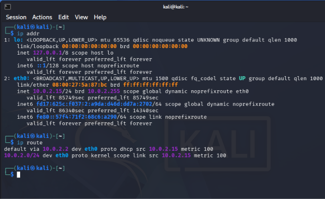
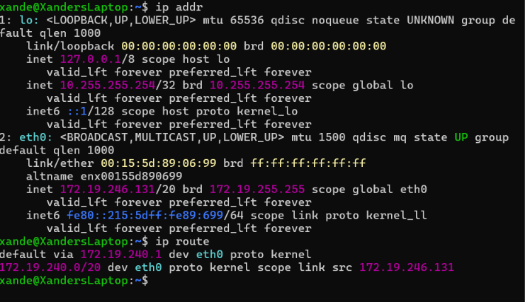
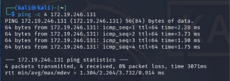
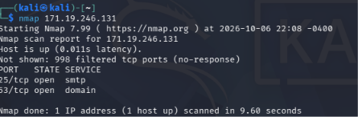
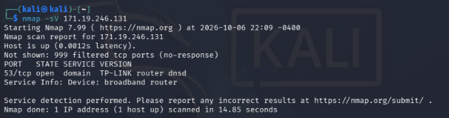
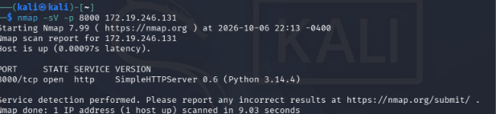
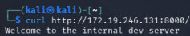
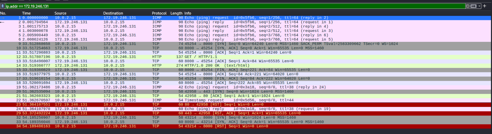
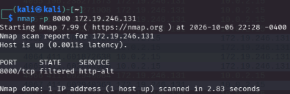
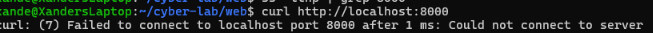

# Cyberlab-Kali-Linux-and-Nmap

## Overview
This project will document a small lab built to practice cybersecurity fundamentals relevant to system security roles. Using Kali Linux and a target (another VM) I will perform network discovery and enumeration to better understand attack reduction and verification.

## Key Objectives
- Learn basic Linux tools
- Practice host and service discovery with Nmap
- Investigate what processes were bound to open ports
- Verify remediation through rescanning procedures
- Reduce attack surfaces

## Environment

- Kali Linux VM
- Ubuntu [Target VM]
- Isolated local virtual network

## Tools Used
- Nmap
- Linux
- ss
- ps
- curl
- A Python 3 HTTP server [for testing]

## Procedures

## 1. Identifying Network Configuration

The first step was identifying the network configuration of both systems.

I used:

```bash
ip addr
ip route
```

This allowed me to identify each system's IPv4 address, network interface,
and routing configuration.

### Kali Linux

Kali was used as the system performing network reconnaissance and testing.



### Ubuntu Target

Ubuntu served as the target system for the lab.



### What I Learned

`ip addr` displays information about the network interfaces configured on a
Linux system, while `ip route` displays how the system determines where
network traffic should be sent.

---

## 2. Testing Connectivity

Before performing network scans, I ensured that Kali can communicate with Ubuntu.

```bash
ping -c 4 <TARGET-IP>
```



The target successfully responded to the requests, confirming that
the two systems could communicate.

This established basic connectivity before moving on to service discovery.

---

## 3. Initial Port Discovery

After confirming connectivity, I used Nmap to examine the target system.

```bash
nmap <TARGET-IP>
```



### Findings

The scan demonstrated that Nmap could determine which TCP ports were reachable
from the Kali system.

This is important because exposed ports can indicate network-accessible
services that should be investigated.

---
## 4. Service Enumeration

Finding an open port does not always explain what software is responsible
for it. I therefore performed service/version detection.

```bash
nmap -sV <TARGET-IP>
```



The `-sV` option attempts to identify the services responding on discovered
ports.

### What I Learned

There is an important difference between identifying an open port and
understanding the service behind that port.

---
## 5. Creating a Controlled Test Service

To better understand how applications create network exposure, I intentionally
started a Python3 HTTP server in the lab.

```bash
python3 -m http.server 8000
```

The server created a network service listening on TCP port `8000`.

From Kali, I scanned that specific port:

```bash
nmap -sV -p 8000 <TARGET-IP>
```



Nmap successfully detected the HTTP service running on port 8000.

---
## 6. Verifying the HTTP Service

After discovering the service with Nmap, I used `curl` to communicate with it
directly.

```bash
curl http://<TARGET-IP>:8000/
```



The server returned:

```text
Welcome to the internal dev server
```

This demonstrated that port discovery alone does not represent the entire
investigation. After discovering a service, I could interact with it using its
expected protocol to verify what was actually being served.

---

## 7. Network Traffic Analysis with Wireshark

I also captured communication between Kali and the target using Wireshark.



The capture allowed me to observe traffic generated during the lab, including
ICMP traffic from `ping` communication with the test web server.

### TCP Connection

The packet capture also demonstrated the TCP connection process:

```text
SYN → SYN-ACK → ACK
```

This helped connect concepts such as the 3-way TCP handshake and HTTP requests to
actual packets traveling between two systems.

---

## 8. Remediation

After investigating the test service, I stopped the Python HTTP server.

The objective was to remove the unnecessary listening service and reduce the
target's network exposure.

I then verified locally that the service was no longer accessible.

```bash
curl http://localhost:8000
```



The connection failed because the HTTP server was no longer running.

---

## 9. External Verification

Finally, I returned to Kali and rescanned TCP port 8000.

```bash
nmap -p 8000 <TARGET-IP>
```



Nmap reported the port as **filtered** from Kali's perspective.

This reinforced an important distinction between Nmap port states. A filtered
port does not necessarily mean that no local process exists; it means Nmap
could not determine whether the port was open because its probes were being
filtered.

For that reason, remediation should be verified using both local system
inspection and external network testing. No connection was formed, indicating that the port is no longer in service.

---
# Findings [WIP]
This lab demonstrated a basic security assessment and remediation workflow:

```text
Identify
   ↓
Discover
   ↓
Enumerate
   ↓
Investigate
   ↓
Verify
   ↓
Remediate
   ↓
Rescan
```
